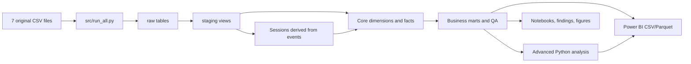

# Start here

This is the only file you need to open first.

The project takes **seven original TheLook CSV files**, builds a tested analytics warehouse, reconstructs sessions from `events.csv`, runs business and advanced analysis, and exports a Power BI-ready model.

## If you have only 15 minutes

Read these files in order:

1. **This page** — understand the map.
2. [`docs/analysis_findings.md`](docs/analysis_findings.md) — see the validated results.
3. [`docs/01_PROJECT_WALKTHROUGH.md`](docs/01_PROJECT_WALKTHROUGH.md) — understand every folder and process touchpoint.
4. [`private_review/validation_report.md`](private_review/validation_report.md) — confirm the build passed.
5. [`power_bi/README.md`](power_bi/README.md) — start building the `.pbix`.

You do **not** need to inspect every generated CSV, Parquet file, image, or log.

## The project in one flow

## Important source correction

`dim_sessions.csv` is **not** an original dataset file. It was a legacy artifact created during the old analysis.

The corrected project:

- loads only seven original files;
- ignores the legacy session artifact even if it is present beside the source files;
- creates `stg.sessions` by grouping `events.csv` on `session_id`;
- creates `core.fact_session` from that derived view;
- reconciles source event rows and distinct session IDs to the modeled session fact.

The detailed field logic and audit evidence are in [`docs/02_SESSIONIZATION_FROM_EVENTS.md`](docs/02_SESSIONIZATION_FROM_EVENTS.md).

## Choose your review path

### I want to understand the business analysis

1. `docs/analysis_findings.md`
2. `docs/business_questions.md`
3. `docs/kpi_dictionary.md`
4. `notebooks/01_data_quality_and_core_analysis.ipynb`
5. `notebooks/02_statistical_deep_dives.ipynb`
6. `notebooks/04_reproducible_build.ipynb`

### I want to review the SQL and data model

1. `docs/architecture.md`
2. `docs/source_inventory.md`
3. `docs/02_SESSIONIZATION_FROM_EVENTS.md`
4. `sql/duckdb/01_staging.sql` through `07_quality_and_snapshots.sql`
5. `private_review/sql_review_checklist.md`

### I want to build the Power BI report

1. `power_bi/README.md`
2. `power_bi/data_model.md`
3. `power_bi/model_relationships.csv`
4. `power_bi/measures.dax`
5. `power_bi/dashboard_blueprint.md`
6. `private_review/power_bi_build_checklist.md`

### I want to verify that the work is trustworthy

1. `private_review/validation_report.md`
2. `private_review/session_lineage_audit.md`
3. `private_review/data_quality_review.md`
4. `outputs/qa/test_results.csv`
5. `outputs/qa/metric_reconciliation.csv`
6. `notebooks/03_event_sessionization_audit.ipynb`

## Files to avoid reading first

| Location | Why it exists | What you should do |
|---|---|---|
| `data/processed/` | Generated Power BI and analysis tables | Import them; do not manually review every row |
| `artifacts/` | Warehouse, models, metrics, and figures | Use only when validating or presenting results |
| `logs/` | Backend execution details | Open only after a failed run |
| `src/` | Automation implementation | Review only if changing the pipeline |
| `outputs/qa/` | Machine-readable QA evidence | Start with the readable private review instead |

For the complete map, continue to [`docs/01_PROJECT_WALKTHROUGH.md`](docs/01_PROJECT_WALKTHROUGH.md).
