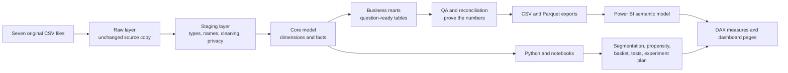

# TheLook BI project — build-it-yourself practice

This folder is your practice workspace. The finished project in `new_analysis` is the
answer key; this folder is where you learn to reproduce the process yourself from the
seven original CSV files.

## Read these three files in this order

1. **`00_START_HERE.md`** — understand the route and the folder structure.
2. **`01_BUILD_IT_YOURSELF_GUIDE.md`** — perform every stage, with commands, SQL,
   Python, Power BI actions, explanations, and examples.
3. **`02_CHECKPOINTS_AND_ANSWER_KEY.md`** — check your work after each stage.

Do not open the finished SQL first. Try each checkpoint yourself, run it, inspect the
result, and only then compare with the answer-key link.

## The complete process in one picture



The arrows are the **data lineage**. If a dashboard number looks wrong, trace it
backward: visual → DAX measure → exported table → mart/fact → staging → raw CSV.

## The seven and only seven original data files

| File | Natural grain | What one row means |
|---|---|---|
| `users.csv` | user | One registered customer |
| `products.csv` | product | One product in the catalogue |
| `orders.csv` | order | One order |
| `order_items.csv` | order item | One product line inside an order |
| `events.csv` | event | One website action |
| `inventory_events.csv` | inventory item | One physical inventory unit |
| `distribution_centers.csv` | distribution center | One fulfillment center |

`dim_sessions.csv` is **not** an original source. You must not ingest it. You will
derive a session table from `events.csv` by grouping events on `session_id`.

## What each project layer is for

| Layer | Question it answers | Example | Rule |
|---|---|---|---|
| Source | What was delivered to me? | Seven CSV files | Never edit the source |
| Raw | What exactly did I ingest? | `raw.events` | Preserve rows and columns |
| Staging | How do I standardize it safely? | `stg.events` | Cast, trim, rename, exclude PII |
| Core | What are the reusable business entities and transactions? | `core.dim_product`, `core.fact_order_item` | Declare one grain per table |
| Mart | What table answers a specific business question? | `mart.sales_monthly` | Aggregate to the visual’s grain |
| QA | Can I prove no rows or money disappeared? | `qa.metric_reconciliation` | Critical failures stop publishing |
| Export | What will another tool load? | Parquet/CSV files | Export only approved fields |
| Semantic model | How do tables relate in Power BI? | Star schema | One-to-many from dimensions to facts |
| Measure | How is a KPI calculated under filters? | `[Net Sales]` | Prefer measures over precomputed columns |
| Dashboard | What should a decision-maker see and do? | Revenue page | Every visual must serve a question |

## Target folder structure

You will create this structure gradually. Generated folders remain empty until the
pipeline runs.

```text
practice_analysis/
├── 00_START_HERE.md
├── 01_BUILD_IT_YOURSELF_GUIDE.md
├── 02_CHECKPOINTS_AND_ANSWER_KEY.md
├── README.md                         # you write this near the end
├── .gitignore
├── config.example.json
├── requirements.txt
├── data/
│   ├── README.md
│   └── processed/                    # generated; do not commit
│       ├── analysis/
│       ├── advanced/
│       └── power_bi/
│           ├── csv/
│           └── parquet/
├── artifacts/                        # generated DB, figures, run metadata
├── docs/
│   ├── business_questions.md
│   ├── architecture.md
│   ├── source_inventory.md
│   ├── data_dictionary.md
│   ├── kpi_dictionary.md
│   ├── assumptions_and_limitations.md
│   ├── analysis_findings.md
│   └── advanced_methods.md
├── logs/                             # generated
├── notebooks/
│   ├── 01_data_quality_and_core_analysis.ipynb
│   ├── 02_advanced_methods.ipynb
│   └── 03_event_sessionization_audit.ipynb
├── outputs/
│   └── qa/                           # generated check results
├── power_bi/
│   ├── README.md
│   ├── data_model.md
│   ├── measures.dax
│   ├── calculated_columns.dax
│   ├── dashboard_blueprint.md
│   ├── model_relationships.csv
│   ├── power_query_parameters.m
│   └── theme.json
├── sql/
│   └── duckdb/
│       ├── 01_staging.sql
│       ├── 02_core_dimensions.sql
│       ├── 03_core_facts.sql
│       ├── 04_mart_acquisition_funnel.sql
│       ├── 05_mart_commercial_customer.sql
│       ├── 06_mart_operations_inventory.sql
│       └── 07_quality_and_snapshots.sql
├── src/
│   ├── profile_sources.py
│   ├── pipeline.py
│   ├── advanced_analytics.py
│   ├── build_notebooks.py
│   ├── render_outputs.py
│   ├── validate_project.py
│   └── run_all.py
└── tests/
    └── test_project_contracts.py
```

There is deliberately no `private_review/` folder in this practice version. The
finished project uses that folder for analyst-only notes, but you asked for a
public-safe practice project.

## Recommended learning sequence

Do not try to build everything in one sitting.

| Session | Build | Stop when |
|---|---|---|
| 1 | Business questions, grains, folders, environment | Python and DuckDB import successfully |
| 2 | Source profiling and raw ingestion | Seven raw tables match seven CSV row counts |
| 3 | Staging and event-derived sessions | 680,862 sessions reconcile to 2,420,661 events |
| 4 | Dimensions | Keys are unique and customer export contains no direct PII |
| 5 | Facts | Fact row counts and timeline flags make sense |
| 6 | Marts | Each mart has one declared grain and one business owner/question |
| 7 | QA and reconciliation | No blocking failures; warnings are documented |
| 8 | Export and Power BI model | Relationships are one-to-many and filters flow correctly |
| 9 | DAX and dashboard pages | Every KPI matches an independent SQL check |
| 10 | Advanced analytics and notebooks | Methods are evaluated, not merely run |
| 11 | Automation, validation, README | A clean rebuild works from one command |

## Your rules while practicing

1. Type the important SQL and Python yourself. Typing forces you to notice grain,
   joins, filters, and denominators.
2. Run one module at a time before using `run_all.py`.
3. Inspect at least five rows and a row count after every new table.
4. Write the grain above every fact and mart query.
5. Reconcile before interpreting. A chart is not evidence until the rows and totals
   reconcile.
6. Treat warnings as findings to explain, not errors to hide.
7. Keep the original CSV folder read-only. Your project should store paths and
   fingerprints, not duplicate or edit the originals.
8. Do not put names, email addresses, street addresses, or IP addresses into Power BI
   exports.
9. Do not compare your output with the answer key until you have written down what
   you expected and what actually happened.
10. Commit code and documentation; ignore source data, generated data, the database,
    logs, notebook checkpoints, local configuration, and Power BI binaries.

## Start now

Open `01_BUILD_IT_YOURSELF_GUIDE.md` and complete **Stage 0 through Stage 2** only.
Then use the first section of `02_CHECKPOINTS_AND_ANSWER_KEY.md` to review your work.

