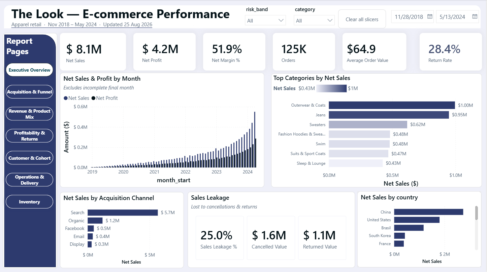
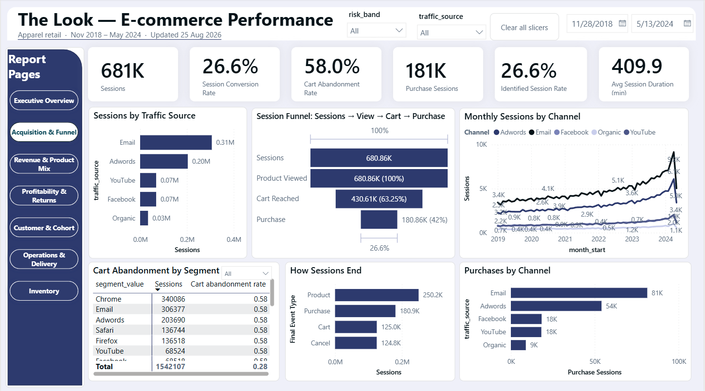
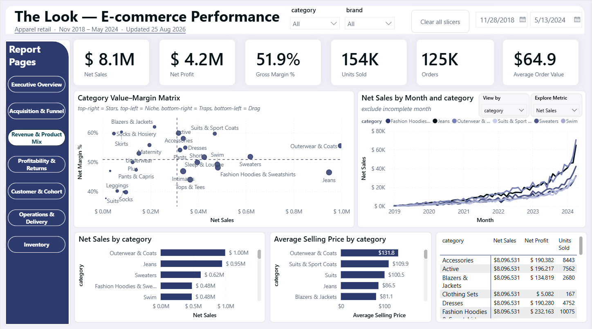
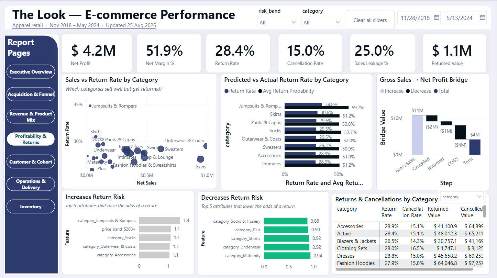
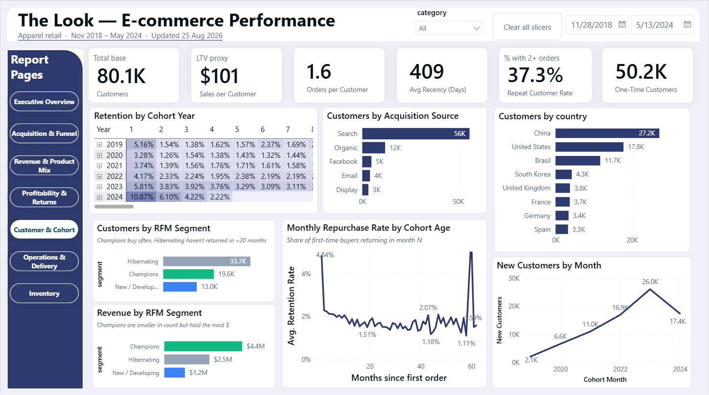
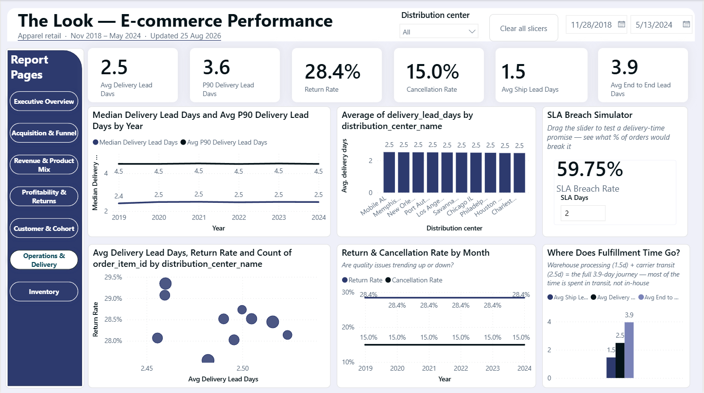
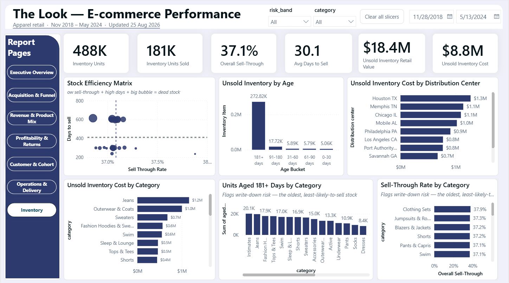

# The Look eCommerce — End-to-End Retail Analytics & BI Pipeline

**SQL data warehouse · Python analytics & ML · Power BI dashboard — built from seven raw CSVs, validated by 20+ automated contracts, and reproducible with one command.**

<!-- TODO(you): paste your live dashboard link here once published, e.g. Publish-to-web URL -->
🔗 **Live dashboard:** [View the interactive Power BI report](https://app.powerbi.com/view?r=eyJrIjoiNmZiNzVmYzQtZTE4OC00ZTM0LThmZDYtNThmMzQ5MjljNGMxIiwidCI6IjNkZmNkMTY2LWYzZmUtNGQxNS1hNDYzLTA0NTU2YzMwNWZmMiIsImMiOjEwfQ%3D%3D)

---

## 1. Executive Summary

This project takes the **seven original TheLook eCommerce source files** (a synthetic but
realistically messy retail dataset) and turns them into a decision-ready analytics product:
a tested **DuckDB star-schema warehouse**, a layer of **Python statistical & machine-learning
analysis**, and a **7-page Power BI dashboard** for executives, marketing, operations, and
merchandising.

**The elevator pitch.** Starting from ~2.4M raw events and ~125k orders, I rebuilt sessions
from event logs, modeled a conformed star schema, and quantified the full commercial picture —
**\$8.10M net sales**, **\$4.20M net profit (51.9% margin)**, a **26.6% session-to-purchase
conversion**, a **58% cart-abandonment rate**, and a **28.4% item-return rate**. On top of the
warehouse I ran a Gini-coefficient concentration analysis, RFM customer segmentation, and a
return-propensity model — each reported *honestly*, including where the synthetic data has no
real predictive signal.

### Headline metrics (full history; latest partial month excluded from period comparisons)

| Metric | Value | Metric | Value |
|---|---|---|---|
| Gross Sales | **\$10,796,336** | Sessions | **680,862** |
| Net Sales | **\$8,096,531** | Session Conversion Rate | **26.56%** |
| Net Profit | **\$4,201,367** | Cart Abandonment Rate | **58.00%** |
| Net Margin | **51.9%** | Observed Return Rate | **28.43%** |
| Orders | **124,814** | Item Cancellation Rate | **14.97%** |
| Customers | **80,095** | Repeat Customer Rate | **37.29%** |

### Dashboard preview


*Executive Overview — headline KPIs, monthly net sales & profit, top categories, sales leakage.
The live report above has 7 pages in total; the rest are below.*

<details>
<summary><strong>See all 7 dashboard pages</strong> (click to expand)</summary>


*Acquisition & Funnel — sessions by channel, cart-to-purchase funnel, abandonment by segment.*


*Revenue & Product Mix — category value-margin matrix, units sold trend, average selling price.*


*Profitability & Returns — return-risk model outputs, gross-to-net profit bridge, top return drivers.*


*Customer & Cohort — RFM segments, retention curve, repeat-purchase rate by cohort age.*


*Operations — delivery lead-time breakdown by stage, SLA breach simulator (what-if parameter).*


*Inventory — stock efficiency matrix, unsold inventory age & cost, sell-through by category.*

</details>


---

## 2. Business Problem & Goals

**The problem.** Raw transactional logs answer *nothing* on their own. Leadership could not see
where revenue leaks to cancellations and returns, which customers are worth retaining, which
channels convert, where delivery is slow, or where cash is trapped in unsold stock — because the
data lived in seven disconnected files with messy types, censored outcomes, and no session model.

**The goal.** Build a single trustworthy pipeline that answers the questions each team actually
asks, and hand it off as a self-service dashboard:

| Stakeholder | Question the project answers |
|---|---|
| **Executive** | How much are we really making after cancellations and returns, and is it growing? |
| **Marketing** | Which acquisition channels bring volume *and* quality (conversion, retention)? |
| **Merchandising** | Which categories drive revenue vs. margin, and which get returned? |
| **CRM / Retention** | Who are our Champions vs. Hibernating customers, and how fast do cohorts churn? |
| **Operations** | Where is delivery slow, and where do returns concentrate? |
| **Inventory** | Where is stock aging and tying up cash? |

**Primary KPIs targeted:** Net Sales, Net Profit & Margin, AOV, Session Conversion, Cart
Abandonment, Observed Return Rate, Repeat-Customer Rate, Cohort Retention, Sell-Through, and
Days-to-Sell.

---

## 3. Tech Stack

| Layer | Tool | Role |
|---|---|---|
| **Extract / orchestration** | **Python** (`pandas`, `duckdb`) | Read the 7 source CSVs, drive the build, enforce contracts |
| **Transform / warehouse** | **SQL on DuckDB** (`raw → stg → core → mart → qa`) | Typing, session reconstruction, star schema, decision marts, tests |
| **Analytics & ML** | **Python** (`scikit-learn`, `numpy`, `matplotlib`, `seaborn`) | Gini/Lorenz concentration analysis, RFM K-means segmentation, logistic-regression return model |
| **Reporting** | **Power BI** (star schema, DAX, drill-through, field parameters, what-if) | 7-page executive-to-operations dashboard |

This is a **local ELT pipeline** — run entirely on one machine, loading raw first and then
transforming *inside* the warehouse with SQL (`raw → stg → core → mart → qa`), the pattern most
analytics-engineering roles use today. Everything is triggered by **one command**
(`python src/run_all.py --rebuild`) and gated by `src/validate_project.py`, which fails the build
unless 20+ contracts hold.

> **Full architecture** — the layer diagram, layer responsibilities, declared grains, source
> contract, and event-to-session derivation are documented in
> [`docs/technical_reference.md`](docs/technical_reference.md).

---

## 4. Key Insights & Recommendations

> Insights below combine the warehouse-computed metrics with a page-by-page read of the built
> Power BI dashboard. The dataset is **synthetic**, so patterns reflect its generator, not a real
> market — the transferable value is the *method*. Full metric tables are in
> [`docs/analysis_and_findings.md`](docs/analysis_and_findings.md).

**Core discoveries, grouped by dashboard page**

*Acquisition & Funnel*

- **Two channel lenses give two different leaders.** Email leads by session volume (306K
  sessions), but Search leads by acquisition-attributed net sales (\$5.7M — more than 4x the next
  source). Budget decisions should be anchored to the value lens, not the volume lens.
- **The funnel loses a comparable number of sessions at each stage, but at very different rates.**
  Product-view → cart loses 250K sessions (a 37% drop); cart → purchase loses a nearly identical
  250K sessions, but that's a much steeper 58% drop from a smaller base. Cart abandonment is the
  standout *rate*, even though discovery-to-cart loses almost as many sessions in absolute terms.
- **Cart abandonment sits close to 58% across nearly every channel and browser shown** — it looks
  like a checkout-experience issue, not a channel-quality or browser-compatibility one.

*Revenue, Growth & Geography*

- **Revenue survives cancellations and returns, but not cheaply.** \$10.80M gross becomes \$8.10M
  net (−\$1.6M cancelled, −\$1.1M returned) — a **25% leakage** that Ops and merchandising can
  attack directly.
- **The monthly chart looks like an accelerating hockey stick — the underlying growth rate isn't
  actually accelerating.** Year-over-year net sales growth peaked in 2020 (+227%, off a small
  base) and has settled into a fairly steady 71–76% range for 2022–2023. The hockey-stick shape
  is compounding on a growing base, not a genuine speed-up in the growth *rate*.
- **China is the single largest net-sales market**, ahead of the United States — worth flagging in
  case it differs from what a stakeholder expects.

*Customers & Retention*

- **Spending is concentrated (Gini ≈ 0.58).** A minority of customers drive a disproportionate
  share of revenue — retention economics beat blanket acquisition.
- **Champions are a small slice that punches far above its weight.** Champions are only 29.5% of
  segmented customers (19,550 of 66,215) but generate 63.3% of the combined Champions+Hibernating
  net sales (\$4.39M vs. \$2.55M from 33,688 Hibernating customers).
- **Newer purchase cohorts show higher month-1 retention than older ones** — a promising signal,
  but it's based on fewer complete months of data; worth re-checking once 2024 finishes before
  treating it as a confirmed trend rather than noise.

*Product & Profitability*

- **Jumpsuits & Rompers is a clear return-rate outlier** (~35%, vs. 28–30% for most other
  categories) — a candidate for targeted investigation rather than a category-wide policy change.
- **The return-risk model's predicted probabilities run roughly double the actual return rate in
  every category** (e.g., Jumpsuits: 34.8% actual vs. 59.7% predicted). This is a concrete
  illustration of why AUC ≈ 0.50 means the model isn't just weak — it's also poorly calibrated.
- **The return model is honestly weak (AUC ≈ 0.50).** On the available pre-outcome features there
  is little signal; the right recommendation is *better feature/outcome logging*, not deploying a
  weak model.

*Operations & Fulfillment*

- **Delivery is uniform (~2.5 days median across all DCs).** No single distribution center is a
  bottleneck in this data — so the fulfillment lever is carrier transit, which is ~62% of the
  end-to-end clock.
- **A 2-day delivery promise would currently be breached by ~60% of orders**, per the dashboard's
  SLA breach simulator — a concrete number for setting realistic delivery-time claims before
  marketing an expedited-shipping option.

*Inventory*

- **Once stock fails to sell within about six months, it tends to stay unsold indefinitely.** The
  181+ day age bucket alone holds ~273K unsold units — nearly 8x as many as all three younger
  buckets combined (~34K).
- **Houston TX carries the single highest unsold-inventory cost** among distribution centers
  (\$1.3M) — a candidate for a first clearance/markdown pass.

> **A pattern to read carefully:** several operational dimensions — delivery lead time by year and
> by distribution center, sell-through rate by category, cart abandonment by channel/browser —
> show unusually little variation on this dataset. That's consistent with this being a synthetic,
> generator-driven dataset rather than a genuine "everything performs identically" operational
> result, and it's worth naming explicitly rather than presenting flat charts as confirmed findings.

**Strategic actions, grouped by owner**

*Customer & Retention*

1. **Protect Champions, reactivate Hibernating.** Champions generate nearly double the revenue of
   Hibernating from fewer than half as many customers — loyalty perks for the high-value tail, and
   a low-cost win-back to the 33.7K Hibernating customers where even a small lift compounds.
2. **Validate the newer-cohort retention signal before acting on it.** Re-check month-1 retention
   by cohort once 2024 is a complete year; if the improvement holds, identify what changed
   (onboarding, product mix, channel mix) around the shift.

*Channel & Acquisition*

3. **Anchor acquisition budget to value, not volume.** Search drives the most net sales per
   dollar of attention; Email drives the most sessions. Make sure spend decisions use the
   acquisition-value lens, not just session counts.
4. **Treat checkout/cart experience as the highest-*rate* leak, without deprioritizing
   discovery-to-cart.** Cart abandonment (58%) is the steepest single-stage drop, but
   product-view-to-cart loses a comparable number of sessions (37% of a larger base) — both
   deserve investment, not just checkout.

*Product & Returns*

5. **Attack the 25% revenue leakage** via returns/cancellation root-cause work on the highest-\$
   categories (Outerwear & Coats, Jeans, Suits & Sport Coats lead net sales).
6. **Investigate Jumpsuits & Rompers specifically** (sizing guidance, fit info, product imagery)
   given its outlier return rate, rather than a blanket returns-policy change.
7. **Improve return-risk feature/outcome logging before trusting a model.** The current
   ROC-AUC ≈ 0.50 means the honest recommendation is better inputs, not a weak model in production.

*Operations & Fulfillment*

8. **Don't advertise a 2-day delivery guarantee without operational change first.** Current
   fulfillment would breach that promise on roughly 60% of orders today.

*Inventory*

9. **Prioritize a clearance/markdown review at the Houston TX distribution center**, which carries
   the highest unsold-inventory cost.
10. **Treat the 90–180 day unsold window as the actionable intervention point** (discount, bundle,
    redistribute) — stock that crosses 181 days rarely sells afterward in this data.

---

## 5. Repository Structure

```text
new_analysis/
├── README.md                     # This file — start here
├── requirements.txt              # Python dependencies
├── src/                          # ETL + analytics automation
│   ├── pipeline.py               #   Extract + run the SQL warehouse build
│   ├── advanced_analytics.py     #   RFM segmentation + return-propensity model
│   ├── render_outputs.py         #   Generate the 8 figures
│   ├── build_notebooks.py        #   Regenerate notebooks 01 & 03 from live numbers
│   ├── validate_project.py       #   20+ contract checks (build gate)
│   └── run_all.py                #   One-command orchestrator
├── sql/
│   └── duckdb/                   # 01_staging → 07_quality_and_snapshots (reference build)
├── notebooks/
│   ├── 01_data_quality_and_core_analysis.ipynb   # core commercial / cohort / DQ (generated)
│   ├── 02_statistical_deep_dives.ipynb           # Gini · RFM · Return Propensity (hand-authored)
│   ├── 03_event_sessionization_audit.ipynb       # session lineage proof (generated)
│   └── 04_reproducible_build.ipynb               # Stage 13: reproducibility + figure gallery
├── power_bi/                     # DAX, theme, data model, blueprint, build README
│   └── the_look_ecommerce_performance_dashboard.pbix   # (local only — 97MB, git-ignored)
├── docs/                         # 4 docs: analysis, technical reference, KPI & data dictionaries
├── data/processed/advanced/      # Model deliverables (committed)
├── artifacts/                    # figures/ + validation & metrics JSON (warehouse git-ignored)
├── tests/                        # Project-contract unit tests
└── private_review/               # Internal QA pack (git-ignored)
```

**The four docs:**

| Doc | Audience | Content |
|---|---|---|
| [`docs/analysis_and_findings.md`](docs/analysis_and_findings.md) | Business reviewer | Questions, results, advanced methods, limitations |
| [`docs/technical_reference.md`](docs/technical_reference.md) | Data engineer | Architecture, sources, session derivation, tests, assumptions |
| [`docs/kpi_dictionary.md`](docs/kpi_dictionary.md) | Anyone checking a number | 25 KPI definitions with grain, source, caveat |
| [`docs/data_dictionary.md`](docs/data_dictionary.md) | Anyone using the data model | Dimension / fact / mart field reference |

> Heavy generated data (the DuckDB warehouse, bulk mart exports) and the 97MB `.pbix` are
> git-ignored — the repo ships the **code + docs + small result files + figures**, and anyone
> can regenerate the rest in one command.

---

## 6. Review Paths

Pick the track that matches your goal — you do **not** need to read every file.

### Business / portfolio review (~20 minutes)

1. This README (Sections 1, 2, 4)
2. [`docs/analysis_and_findings.md`](docs/analysis_and_findings.md)
3. [`docs/kpi_dictionary.md`](docs/kpi_dictionary.md)
4. [`notebooks/02_statistical_deep_dives.ipynb`](notebooks/02_statistical_deep_dives.ipynb)

### Data-engineering / SQL review (~30 minutes)

1. [`docs/technical_reference.md`](docs/technical_reference.md)
2. [`docs/data_dictionary.md`](docs/data_dictionary.md)
3. `sql/duckdb/01_staging.sql` through `07_quality_and_snapshots.sql`
4. [`notebooks/03_event_sessionization_audit.ipynb`](notebooks/03_event_sessionization_audit.ipynb)

### Power BI build

1. [`power_bi/README.md`](power_bi/README.md)
2. `power_bi/data_model.md` and `power_bi/model_relationships.csv`
3. `power_bi/measures.dax`
4. `power_bi/dashboard_blueprint.md`

---

## 7. How to Run This Project

**1. Install dependencies**

```bash
python -m pip install -r requirements.txt
```

**2. Build everything (warehouse → models → figures → notebooks → validation)**

```bash
python src/run_all.py --source-csv-dir "<folder with the 7 original CSVs>" --rebuild
```

**3. Review the outputs**

- Findings: [`docs/analysis_and_findings.md`](docs/analysis_and_findings.md)
- Validation passed: [`private_review/validation_report.md`](private_review/validation_report.md)
- Reproducibility trail: [`notebooks/04_reproducible_build.ipynb`](notebooks/04_reproducible_build.ipynb)

**4. Build / open the dashboard**

- Import `data/processed/power_bi/parquet/` (or `csv/`) following [`power_bi/README.md`](power_bi/README.md), **or**
- Open `power_bi/the_look_ecommerce_performance_dashboard.pbix` locally.

---

## Metric conventions (read before comparing numbers)

- **Gross Sales** = all item sale value.
- **Net Sales** = Gross Sales − Cancelled Value − Returned Value.
- **Net Profit** = Net Sales − product cost for retained items.
- **Session Conversion** = purchase sessions / event-derived sessions.
- **Cart Abandonment** = cart sessions without purchase / cart sessions.
- **Observed Return Rate** = returned items / (Complete + Returned items), reducing status censoring.
- **May 2024 is partial** and is excluded from default complete-period comparisons.

## Privacy & honesty notes

- Public docs and Power BI exports contain **no** names, emails, street addresses, or IP addresses.
- The dataset is synthetic; weak model results are reported as weak, never rewritten as wins.
