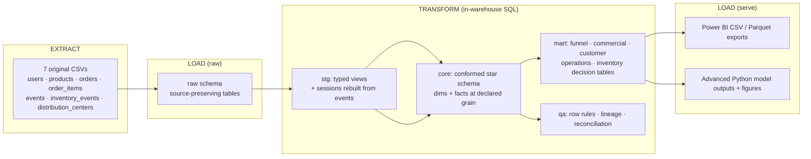

# The Look eCommerce — End-to-End Retail Analytics & BI Pipeline

**SQL data warehouse · Python analytics & ML · Power BI dashboard — built from seven raw CSVs, validated by 20+ automated contracts, and reproducible with one command.**

<!-- TODO(you): paste your live dashboard link here once published, e.g. Publish-to-web URL -->
🔗 **Live dashboard:** [View the interactive Power BI report](https://app.powerbi.com/view?r=eyJrIjoiNmZiNzVmYzQtZTE4OC00ZTM0LThmZDYtNThmMzQ5MjljNGMxIiwidCI6IjNkZmNkMTY2LWYzZmUtNGQxNS1hNDYzLTA0NTU2YzMwNWZmMiIsImMiOjEwfQ%3D%3D)

> **Feeling lost?** Open [`00_START_HERE.md`](00_START_HERE.md) for the guided review order.

---

## 1. Executive Summary

This project takes the **seven original TheLook eCommerce source files** (a synthetic but
realistically messy retail dataset) and turns them into a decision-ready analytics product:
a tested **DuckDB star-schema warehouse**, a layer of **Python statistical & machine-learning
analysis**, and a **7-page Power BI dashboard** for executives, marketing, operations, and
merchandising.

**The elevator pitch.** Starting from ~2.4M raw events and ~125k orders, I rebuilt sessions
from event logs, modeled a conformed star schema, and quantified the full commercial picture —
**\$8.10M net sales**, **\$4.20M net profit (51.9% margin)**, a **26.6% session-to-purchase
conversion**, a **58% cart-abandonment rate**, and a **28.4% item-return rate**. On top of the
warehouse I ran a Gini-coefficient concentration analysis, RFM customer segmentation, and a
return-propensity model — each reported *honestly*, including where the synthetic data has no
real predictive signal.

### Headline metrics (full history; latest partial month excluded from period comparisons)

| Metric | Value | Metric | Value |
|---|---|---|---|
| Gross Sales | **\$10,796,336** | Sessions | **680,862** |
| Net Sales | **\$8,096,531** | Session Conversion Rate | **26.56%** |
| Net Profit | **\$4,201,367** | Cart Abandonment Rate | **58.00%** |
| Net Margin | **51.9%** | Observed Return Rate | **28.43%** |
| Orders | **124,814** | Item Cancellation Rate | **14.97%** |
| Customers | **80,095** | Repeat Customer Rate | **37.29%** |

### Dashboard preview


*Executive Overview — headline KPIs, monthly net sales & profit, top categories, sales leakage.
The live report above has 7 pages in total; the rest are below.*

<details>
<summary><strong>See all 7 dashboard pages</strong> (click to expand)</summary>


*Acquisition & Funnel — sessions by channel, cart-to-purchase funnel, abandonment by segment.*


*Revenue & Product Mix — category value-margin matrix, units sold trend, average selling price.*


*Profitability & Returns — return-risk model outputs, gross-to-net profit bridge, top return drivers.*


*Customer & Cohort — RFM segments, retention curve, repeat-purchase rate by cohort age.*


*Operations — delivery lead-time breakdown by stage, SLA breach simulator (what-if parameter).*


*Inventory — stock efficiency matrix, unsold inventory age & cost, sell-through by category.*

</details>


---

## 2. Business Problem & Goals

**The problem.** Raw transactional logs answer *nothing* on their own. Leadership could not see
where revenue leaks to cancellations and returns, which customers are worth retaining, which
channels convert, where delivery is slow, or where cash is trapped in unsold stock — because the
data lived in seven disconnected files with messy types, censored outcomes, and no session model.

**The goal.** Build a single trustworthy pipeline that answers the questions each team actually
asks, and hand it off as a self-service dashboard:

| Stakeholder | Question the project answers |
|---|---|
| **Executive** | How much are we really making after cancellations and returns, and is it growing? |
| **Marketing** | Which acquisition channels bring volume *and* quality (conversion, retention)? |
| **Merchandising** | Which categories drive revenue vs. margin, and which get returned? |
| **CRM / Retention** | Who are our Champions vs. Hibernating customers, and how fast do cohorts churn? |
| **Operations** | Where is delivery slow, and where do returns concentrate? |
| **Inventory** | Where is stock aging and tying up cash? |

**Primary KPIs targeted:** Net Sales, Net Profit & Margin, AOV, Session Conversion, Cart
Abandonment, Observed Return Rate, Repeat-Customer Rate, Cohort Retention, Sell-Through, and
Days-to-Sell.

---

## 3. Tech Stack & Architecture

### Tools used

| Layer | Tool | Role |
|---|---|---|
| **Extract / orchestration** | **Python** (`pandas`, `duckdb`) | Read the 7 source CSVs, drive the build, enforce contracts |
| **Transform / warehouse** | **SQL on DuckDB** (`raw → stg → core → mart → qa`) | Typing, session reconstruction, star schema, decision marts, tests |
| **Analytics & ML** | **Python** (`scikit-learn`, `numpy`, `matplotlib`, `seaborn`) | Gini/Lorenz concentration analysis, RFM K-means segmentation, logistic-regression return model |
| **Reporting** | **Power BI** (star schema, DAX, drill-through, field parameters, what-if) | 7-page executive-to-operations dashboard |

### Pipeline Architecture — a Local ETL/ELT pipeline

Yes — this project is a **local ETL pipeline**, run entirely on one machine with no cloud
dependency. More precisely it follows the modern **ELT** shape (load raw first, then transform
*inside* the warehouse with SQL), which is the pattern most analytics-engineering roles use today:



**How the E-T-L maps to this repo:**

- **Extract** — `src/pipeline.py` reads *only* the seven declared CSVs (any legacy/derived file
  beside them is ignored) and profiles them.
- **Load (raw)** — each source lands in a source-preserving `raw` table.
- **Transform** — seven numbered SQL modules (`sql/duckdb/01_staging.sql` … `07_quality_and_snapshots.sql`)
  do all the real work in-warehouse: casting & normalization (`stg`), **session reconstruction
  from `events.csv`** (`stg.sessions`), the conformed star schema (`core`), decision-oriented
  aggregates (`mart`), and a battery of data-quality tests (`qa`).
- **Load (serve)** — marts are exported to CSV **and** Parquet for Power BI, and the advanced
  Python layer writes model tables + figures.

Everything above is triggered by **one command** (`python src/run_all.py --rebuild`) and gated
by `src/validate_project.py`, which fails the build unless 20+ contracts hold.

### Layer responsibilities & declared grains

| Layer | Purpose | Grain examples |
|---|---|---|
| `raw` | Load only the seven originals | 1 row per source row |
| `stg` | Types, normalization, privacy boundary, **event-derived sessions** | views |
| `core` | Star-schema dims & facts | `fact_order_item` = 1 row/item; `fact_session` = 1 row/`session_id` |
| `mart` | Decision aggregates | `customer_360` = 1 row/customer; `cohort_retention` = 1 row/cohort-month × month |
| `qa` | Tests, lineage, reconciliation | 1 row per check |

**Source-of-truth rule:** a session table is *not* a source input. `stg.sessions` is derived
inside SQL from `events.csv` grouped by `session_id`, and reconciles exactly —
**2,420,661 events → 680,862 sessions with zero variance** (see
[`notebooks/03_event_sessionization_audit.ipynb`](notebooks/03_event_sessionization_audit.ipynb)).

---

## 4. End-to-End Workflow Stages

### Stage 1 — Extract & profile (Python)
`src/pipeline.py` loads the seven CSVs and records a source-inventory fingerprint. The original
dataset is exactly these seven files — there is no separate session file; sessions are
reconstructed inside SQL from `events.csv` in Stage 2.

### Stage 2 — Model in SQL (`raw → stg → core → mart → qa`)
Seven numbered DuckDB modules handle messy-data reality: parsing irregular timestamps, excluding
**shipment-before-order** timeline violations from delivery metrics, censoring-aware return
logic (`Observed Return Rate = returned / (Complete + Returned)`), and a star schema with
**no fact-to-fact relationships**.
<!-- TODO(you): optionally add a screenshot of one advanced SQL query (e.g. the cohort or sessionization CTE) -->
> **[OPTIONAL — ADD SQL SCREENSHOT]** e.g. the `stg.sessions` reconstruction or the cohort-retention CTE.

### Stage 3 — Analyze (Python statistical & ML deep-dives)
[`notebooks/02_statistical_deep_dives.ipynb`](notebooks/02_statistical_deep_dives.ipynb) walks
through three methods cell-by-cell (question → query → result → chart → interpretation → caveat):

- **Gini coefficient + Lorenz curve** — revenue concentration (Gini ≈ **0.58**).
- **RFM segmentation (K-means)** — **66,215** customers → **3** segments (silhouette 0.33).
- **Return propensity (logistic regression)** — honest **ROC-AUC ≈ 0.50** on this synthetic data.

### Stage 4 — Report (Power BI)
A 7-page report (Executive, Acquisition & Funnel, Revenue & Product Mix, Profitability & Returns,
Customer & Cohort, Operations, Inventory) imports the Parquet exports and the model scores, with
a DAX measure library, drill-through, field parameters, and a what-if SLA simulator. Build guide:
[`power_bi/README.md`](power_bi/README.md).

### Stage 5 — Prove reproducibility (Stage 13 notebook)
[`notebooks/04_reproducible_build.ipynb`](notebooks/04_reproducible_build.ipynb) is the audit
trail: it re-derives the table inventory, the validation status, the QA ledger, the headline
model numbers, and gathers all eight figures in one gallery.

---

## 5. Key Insights & Recommendations

> Numbers below are computed from the warehouse. The dataset is **synthetic**, so patterns
> reflect its generator, not a real market — the transferable value is the *method*.
> <!-- TODO(you): replace/extend any bullet with your own dashboard-derived reading + screenshot -->

**Core discoveries**

- **Revenue survives cancellations and returns, but not cheaply.** \$10.80M gross becomes
  \$8.10M net (−\$1.6M cancelled, −\$1.1M returned) — a **25% leakage** that Ops and merchandising
  can attack directly.
- **Spending is concentrated (Gini ≈ 0.58).** A minority of customers drive a disproportionate
  share of revenue — retention economics beat blanket acquisition.
- **Three actionable customer segments.** Champions (**19,550** customers, highest value per head),
  New/Developing (**12,977**, freshest recency), and Hibernating (**33,688**, half the base,
  ~20 months since last order).
- **The return model is honestly weak (AUC ≈ 0.50).** On the available pre-outcome features there
  is little signal; the right recommendation is *better feature/outcome logging*, not deploying a
  weak model.
- **Delivery is uniform (~2.5 days median across all DCs).** No single distribution center is a
  bottleneck in this data — so the fulfillment lever is carrier transit, which is ~62% of the
  end-to-end clock.

**Strategic actions a stakeholder could take**

1. **Protect Champions, reactivate Hibernating.** Loyalty perks for the high-value tail; a
   low-cost win-back to the 33.7k Hibernating customers where even a small lift compounds.
2. **Attack the 25% revenue leakage** via returns/cancellation root-cause work on the highest-\$
   categories (Outerwear & Coats, Jeans, Suits & Sport Coats lead net sales).
3. **Improve return-risk feature/outcome logging before trusting a model.** The current
   ROC-AUC ≈ 0.50 means the honest recommendation is better inputs, not a weak model in production.

<!-- TODO(you): add 2–3 insights that you personally read off the dashboard pages, with screenshots -->
> **[ADD YOUR OWN DASHBOARD INSIGHTS + SCREENSHOTS HERE]**

---

## 6. Repository Structure

```text
new_analysis/
├── 00_START_HERE.md              # Guided review order
├── README.md                     # This file
├── requirements.txt              # Python dependencies
├── src/                          # ETL + analytics automation
│   ├── pipeline.py               #   Extract + run the SQL warehouse build
│   ├── advanced_analytics.py     #   RFM segmentation + return-propensity model
│   ├── render_outputs.py         #   Generate the 8 figures
│   ├── build_notebooks.py        #   Regenerate notebooks 01 & 03 from live numbers
│   ├── validate_project.py       #   20+ contract checks (build gate)
│   └── run_all.py                #   One-command orchestrator
├── sql/
│   └── duckdb/                   # 01_staging → 07_quality_and_snapshots (reference build)
├── notebooks/
│   ├── 01_data_quality_and_core_analysis.ipynb   # core commercial / cohort / DQ (generated)
│   ├── 02_statistical_deep_dives.ipynb           # Gini · RFM · Return Propensity (hand-authored)
│   ├── 03_event_sessionization_audit.ipynb       # session lineage proof (generated)
│   └── 04_reproducible_build.ipynb               # Stage 13: reproducibility + figure gallery
├── power_bi/                     # DAX, theme, data model, blueprint, build README
│   └── the_look_ecommerce_performance_dashboard.pbix   # (local only — 97MB, git-ignored)
├── docs/                         # Architecture, findings, KPI & data dictionaries, screenshots
├── data/processed/advanced/      # Model deliverables (committed)
├── artifacts/                    # figures/ + validation & metrics JSON (warehouse git-ignored)
├── tests/                        # Project-contract unit tests
└── private_review/               # Internal QA pack (git-ignored)
```

> Heavy generated data (the DuckDB warehouse, bulk mart exports) and the 97MB `.pbix` are
> git-ignored — the repo ships the **code + docs + small result files + figures**, and anyone
> can regenerate the rest in one command.

---

## 7. How to Run This Project

**1. Install dependencies**

```bash
python -m pip install -r requirements.txt
```

**2. Build everything (warehouse → models → figures → notebooks → validation)**

```bash
python src/run_all.py --source-csv-dir "<folder with the 7 original CSVs>" --rebuild
```

**3. Review the outputs**

- Findings: [`docs/analysis_findings.md`](docs/analysis_findings.md)
- Validation passed: [`private_review/validation_report.md`](private_review/validation_report.md)
- Reproducibility trail: [`notebooks/04_reproducible_build.ipynb`](notebooks/04_reproducible_build.ipynb)

**4. Build / open the dashboard**

- Import `data/processed/power_bi/parquet/` (or `csv/`) following [`power_bi/README.md`](power_bi/README.md), **or**
- Open `power_bi/the_look_ecommerce_performance_dashboard.pbix` locally.

---

## Metric conventions (read before comparing numbers)

- **Gross Sales** = all item sale value.
- **Net Sales** = Gross Sales − Cancelled Value − Returned Value.
- **Net Profit** = Net Sales − product cost for retained items.
- **Session Conversion** = purchase sessions / event-derived sessions.
- **Cart Abandonment** = cart sessions without purchase / cart sessions.
- **Observed Return Rate** = returned items / (Complete + Returned items), reducing status censoring.
- **May 2024 is partial** and is excluded from default complete-period comparisons.

## Privacy & honesty notes

- Public docs and Power BI exports contain **no** names, emails, street addresses, or IP addresses.
- The dataset is synthetic; weak model results are reported as weak, never rewritten as wins.
