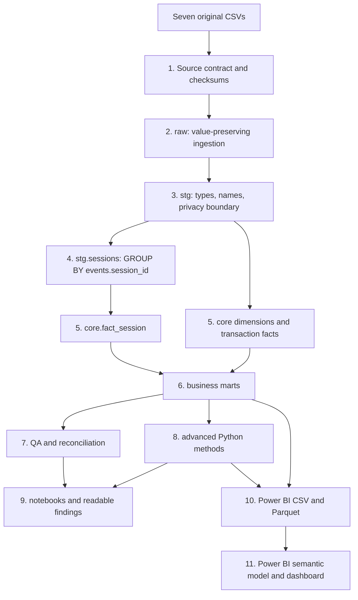

# Project walkthrough: what every folder does

This guide is the project map. It explains what to review, what to edit, what is generated, and how data moves from the seven original CSVs to Power BI.

## 1. The mental model

The project has four kinds of files:

| Type | Purpose | Typical locations | Read first? | Edit manually? |
|---|---|---|---|---|
| Source and logic | Defines how the project works | `src/`, `sql/`, `power_bi/` | Only for technical review | Yes |
| Reader documentation | Explains decisions and results | `00_START_HERE.md`, `docs/` | Yes | Yes |
| Generated evidence | Proves what ran and what resulted | `artifacts/`, `outputs/`, `notebooks/` | Selectively | Normally no |
| Private/local material | Reviewer notes and non-public QA | `private_review/`, `data/processed/`, `logs/` | Yes for review | Generated or local |

Do not measure project quality by reading every file. Review the touchpoints in order.

## 2. End-to-end process



## 3. Folder and file map

| Location | What it contains | Open this first | Edit? | Git/public status |
|---|---|---|---|---|
| `00_START_HERE.md` | Short navigation and review tracks | The file itself | Yes | Public |
| `README.md` | Setup, source contract, and run command | The file itself | Yes | Public |
| `docs/` | Business questions, KPIs, architecture, findings, methods | `01_PROJECT_WALKTHROUGH.md` | Yes | Public |
| `src/` | Python orchestration, analytics, notebook and output generators | `run_all.py` | Yes | Public |
| `sql/duckdb/` | Executed reference warehouse SQL | `01_staging.sql` | Yes | Public |
| `tests/` | Project contract tests | `test_project_contracts.py` | Yes | Public |
| `notebooks/` | Executed, reader-facing analysis and audits | `01_data_quality_and_core_analysis.ipynb` | Generated from `src/build_notebooks.py` | Public if desired |
| `power_bi/` | Model, DAX, theme, page design, build steps | `README.md` | Yes | Public |
| `data/processed/analysis/` | Compact mart exports for analysis | None initially | No | Git-ignored |
| `data/processed/advanced/` | RFM, model, basket, tests, power plan | None initially | No | Git-ignored |
| `data/processed/power_bi/` | The 25 Power BI tables in CSV and Parquet | Folder only when importing | No | Git-ignored |
| `artifacts/` | DuckDB warehouse, JSON metrics, validation, figures | `validation_report.json` | No | Git-ignored |
| `outputs/qa/` | Machine-readable tests and reconciliations | `test_results.csv` | No | Git-ignored |
| `private_review/` | Human-readable QA and build checklists | `00_REVIEW_START_HERE.md` | Some files generated | Git-ignored |
| `logs/` | Pipeline runtime log | `pipeline.log` after a failure | No | Git-ignored |

## 4. Process touchpoints

### Touchpoint 1 — Original source contract

- **Input:** seven original CSV files.
- **Control:** `src/pipeline.py` → `ORIGINAL_SOURCE_TABLES`.
- **Evidence:** `docs/source_inventory.md` and `artifacts/pipeline_run.json`.
- **Check:** the metadata must list exactly seven inputs and no derived session file.

### Touchpoint 2 — Raw ingestion

- **Input:** the seven CSVs.
- **Logic:** `src/pipeline.py`.
- **Output:** seven `raw.*` DuckDB tables.
- **Check:** `private_review/validation_report.md` lists the raw tables checked.

Raw means source-preserving ingestion. Raw tables are not the Power BI model.

### Touchpoint 3 — Staging and privacy

- **Logic:** `sql/duckdb/01_staging.sql`.
- **Purpose:** rename fields, cast types, normalize strings, remove direct PII from modeled data.
- **Output:** typed `stg.*` views.
- **Check:** names, email, street address, and IP never enter Power BI exports.

### Touchpoint 4 — Event-derived sessions

- **Input:** `stg.events`.
- **Logic:** the `stg.sessions` view in `sql/duckdb/01_staging.sql`.
- **Output grain:** one row per `session_id`.
- **Checks:** unique session IDs, stable user/browser/channel inside a session, source events reconcile to session event counts.
- **Detailed guide:** `docs/02_SESSIONIZATION_FROM_EVENTS.md`.

### Touchpoint 5 — Core star schema

- **Dimensions:** date, customer, product, distribution center, session traffic source, customer acquisition source.
- **Facts:** order, order item, session, inventory.
- **Logic:** `sql/duckdb/02_core_dimensions.sql` and `03_core_facts.sql`.
- **Check:** every table has a declared grain; Power BI uses dimension-to-fact relationships only.

### Touchpoint 6 — Business marts

- **Logic:** SQL modules `04` through `06`.
- **Purpose:** prepare reusable decision tables for funnel, revenue, customers, cohorts, products, geography, delivery, returns, and inventory.
- **Output:** `mart.*` tables plus compact CSVs under `data/processed/analysis/`.
- **Check:** marts reconcile to core facts and use the KPI definitions in `docs/kpi_dictionary.md`.

### Touchpoint 7 — Quality and reconciliation

- **Logic:** `sql/duckdb/07_quality_and_snapshots.sql`.
- **Output:** `qa.test_results`, `qa.metric_reconciliation`, and the executive snapshot.
- **Readable review:** `private_review/data_quality_review.md`.
- **Rule:** zero `FAIL` rows are required before Power BI refresh.

### Touchpoint 8 — Advanced analytics

- **Logic:** `src/advanced_analytics.py`.
- **Outputs:** Gini/Lorenz concentration analysis, RFM segmentation, and a temporal return model.
- **Reader artifact:** `notebooks/02_statistical_deep_dives.ipynb` — a hand-authored, cell-by-cell
  reasoning walkthrough of all three methods.
- **Check:** weak model results remain weak; they are not rewritten as successful predictions.

### Touchpoint 9 — Reader-facing outputs

- **Logic:** `src/render_outputs.py` and `src/build_notebooks.py`.
- **Outputs:** findings, QA documents, figures, and three executed notebooks.
- **Check:** notebooks execute top to bottom and figures pass nonblank/resolution checks.

### Touchpoint 10 — Power BI exports

- **Output:** 25 approved tables in both CSV and Parquet.
- **Location:** `data/processed/power_bi/`.
- **Contract:** `src/pipeline.py` → `POWER_BI_TABLES`.
- **Check:** CSV and Parquet table names must match exactly; stale exports cause validation failure.

### Touchpoint 11 — Power BI build

- **Model:** `power_bi/data_model.md`.
- **Relationships:** `power_bi/model_relationships.csv`.
- **Measures:** `power_bi/measures.dax`.
- **Layout:** `power_bi/dashboard_blueprint.md`.
- **Checklist:** `private_review/power_bi_build_checklist.md`.

## 5. Review sequences by goal

### Portfolio/business review — approximately 20 minutes

1. `00_START_HERE.md`
2. `docs/analysis_findings.md`
3. `docs/business_questions.md`
4. `docs/advanced_methods.md`
5. `power_bi/dashboard_blueprint.md`

### Data-engineering and SQL review — approximately 35 minutes

1. `docs/source_inventory.md`
2. `docs/architecture.md`
3. `docs/02_SESSIONIZATION_FROM_EVENTS.md`
4. SQL modules `01` through `07`
5. `outputs/qa/metric_reconciliation.csv`
6. `private_review/sql_review_checklist.md`

### Analytics-method review — approximately 30 minutes

1. `docs/kpi_dictionary.md`
2. `notebooks/01_data_quality_and_core_analysis.ipynb`
3. `notebooks/02_statistical_deep_dives.ipynb`
4. `notebooks/03_event_sessionization_audit.ipynb`
5. `notebooks/04_reproducible_build.ipynb`
6. `docs/assumptions_and_limitations.md`

### Power BI construction

1. Import CSV or Parquet using `power_bi/README.md`.
2. Create relationships from `model_relationships.csv`.
3. Mark the date table.
4. Paste measures from `measures.dax`.
5. Import `theme.json`.
6. Build pages from `dashboard_blueprint.md`.
7. Complete `private_review/power_bi_build_checklist.md`.

## 6. What to edit and what not to edit

Edit:

- SQL under `sql/`;
- Python under `src/`;
- documentation under `docs/`;
- Power BI source files under `power_bi/`;
- tests under `tests/`.

Do not manually edit:

- `data/processed/`;
- `artifacts/*.json`;
- `outputs/qa/`;
- generated findings or QA documents without also updating their generator;
- executed notebooks without also updating `src/build_notebooks.py`.

Generated files will be replaced on the next rebuild.

## 7. How to rerun safely

From the project root:

```powershell
python src/run_all.py `
  --source-csv-dir "<folder containing the seven original CSVs>" `
  --rebuild
```

The run order is:

1. rebuild warehouse;
2. run advanced analytics;
3. render figures and documents;
4. generate notebooks;
5. execute all notebooks;
6. validate the project;
7. save the execution log.

## 8. Definition of done

The project is ready for Power BI only when:

- `private_review/validation_report.md` says `PASS`;
- raw tables equal the seven-file contract;
- source events reconcile to session facts;
- `outputs/qa/test_results.csv` contains no `FAIL`;
- all three notebooks are executed;
- 25 CSV and 25 Parquet exports exist;
- customer and event PII are absent from Power BI outputs.
