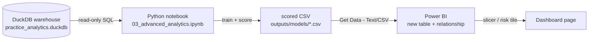

# ML Models Workflow — RFM Segmentation & Return Propensity

How the two machine-learning sections in
[`notebooks/03_advanced_analytics.ipynb`](../notebooks/03_advanced_analytics.ipynb)
turn warehouse tables into **assets that live in Power BI**. This is the guide to the
*stages* of the work and the *handoffs* between tools.

---

## 1. Why these two models exist (the business problems)

| Model | Section | Business problem in one sentence | Decision it informs |
|---|---|---|---|
| **RFM Segmentation** (K-means) | 3.3 | Marketing treats all 80k customers the same and can't tell a champion from a churned one-time buyer. | *Where to spend retention budget* — protect champions, win back at-risk. |
| **Return Propensity** (logistic regression) | 3.5 | Ops sees returns only *after* they happen and can't tell which product lines quietly drive the return bill. | *Which orders/categories to flag* for QA and review. |

Both are the "two-way street" pieces of the project: unlike Gini and hypothesis testing
(which stay as written findings), these two **produce a file that goes back into the
dashboard**.

---

## 2. The end-to-end data flow

The same shape for both models — the warehouse feeds Python, Python trains a model and writes
a small scored file, Power BI relates that file back to the tables it already has.



Plain-language version of the same five steps:

```
DuckDB tables  --(SQL SELECT, read-only)-->  pandas DataFrame
DataFrame      --(scikit-learn fit/predict)-->  model + a label/score per row
label/score    --(DataFrame.to_csv)-->  outputs/models/<name>.csv
CSV            --(Power BI: Get Data > Text/CSV)-->  a new table in the model
new table      --(relationship on the id column)-->  slicers, legends, KPI tiles
```

**Why a CSV in the middle, and not a write back into DuckDB?** Every notebook section opens
the warehouse **read-only** so it can never lock or corrupt the file the pipeline owns. The
model's output is therefore a *new* artifact next to the warehouse, not an edit to it. Power BI
treats it as one more source table.

---

## 3. Where everything lives

| Artifact | Path | Produced by | Consumed by |
|---|---|---|---|
| Warehouse | `artifacts/practice_analytics.duckdb` | `src/pipeline.py` | the notebook (read-only) |
| Notebook | `notebooks/03_advanced_analytics.ipynb` | you | — |
| RFM scores | `outputs/models/customer_rfm_segments.csv` | notebook §3.3 | Power BI |
| Return scores | `outputs/models/order_item_return_scores.csv` | notebook §3.5 | Power BI |

`outputs/models/` is created automatically by the notebook the first time it runs.

---

## 4. Model 1 — RFM Segmentation (§3.3)

### Stages

| # | Stage | Tool | What happens |
|---|---|---|---|
| 1 | Pull R/F/M | DuckDB → pandas | `recency_days`, `order_count`, `net_sales_value` from `mart.customer_360` |
| 2 | Inspect | pandas / matplotlib | see the different scales + right skew that force preprocessing |
| 3 | Preprocess | scikit-learn | `log1p` then `StandardScaler` so R/F/M weigh equally |
| 4 | Choose *k* | scikit-learn | elbow (inertia) + silhouette, read together |
| 5 | Fit | scikit-learn | `KMeans(k=4)` assigns each customer a cluster |
| 6 | Name | pandas | rank clusters on R/F/M → Champions / Loyal / At-Risk / Hibernating |
| 7 | Visualize | matplotlib | snake plot of scaled means = each segment's personality |
| 8 | **Export** | pandas → CSV | one row per customer → `customer_rfm_segments.csv` |

### Output schema — `customer_rfm_segments.csv`

| Column | Type | Note |
|---|---|---|
| `customer_id` | int | **join key** → `dim_customer[user_id]` |
| `recency_days`, `order_count`, `net_sales_value` | num | the raw R/F/M, for tooltip context |
| `cluster` | int | raw K-means id (0–3) |
| `segment` | text | the human name — the field you slice by |

### Power BI integration

1. **Get Data → Text/CSV** → `outputs/models/customer_rfm_segments.csv`.
2. **Model view** → drag `customer_rfm_segments[customer_id]` onto `dim_customer[user_id]`.
   Cardinality **1-to-1**, cross-filter **both**.
3. Drop `segment` into a **slicer**, and onto the **Legend** of the existing revenue/customer
   charts. Every customer visual now splits by segment with no other change.

---

## 5. Model 2 — Return Propensity (§3.5)

### Stages

| # | Stage | Tool | What happens |
|---|---|---|---|
| 1 | Frame + pull | DuckDB → pandas | target `returned_item_flag` + features, only return-eligible items |
| 2 | Class balance | pandas | confirm returns are the minority → don't trust accuracy |
| 3 | Split | scikit-learn | 75/25 train/test, `stratify` to keep the return rate even |
| 4 | Pipeline | scikit-learn | `ColumnTransformer` (scale numerics, one-hot categoricals) + `LogisticRegression(class_weight="balanced")` |
| 5 | Evaluate | scikit-learn | confusion matrix, precision/recall, **ROC-AUC**, ROC curve |
| 6 | Interpret | pandas | coefficients → **odds ratios** = which attributes raise/lower return risk |
| 7 | **Score + export** | pandas → CSV | probability + risk band per item → `order_item_return_scores.csv` |

### Output schema — `order_item_return_scores.csv`

| Column | Type | Note |
|---|---|---|
| `order_item_id` | int | **join key** → `fact_order_item[order_item_id]` |
| `return_probability` | float | model output, 0–1 |
| `risk_band` | text | Low / Medium / High (thirds of the score) |

### Power BI integration

1. **Get Data → Text/CSV** → `outputs/models/order_item_return_scores.csv`.
2. **Model view** → relate `order_item_return_scores[order_item_id]` →
   `fact_order_item[order_item_id]`. Cardinality **1-to-1**.
3. Build the **Operations risk tile**: a card of `AVERAGE(return_probability)`, and a bar of
   **count of High-risk items by `dim_product[category]`** — the category managers' watch-list.

---

## 6. Refresh runbook (when the source data changes)

Run in this order; each step feeds the next:

1. **Rebuild the warehouse** — run `notebooks/02_run_pipeline_and_export.ipynb`
   (or `python -m src.pipeline …`). Refreshes `practice_analytics.duckdb`.
2. **Re-score the models** — run `notebooks/03_advanced_analytics.ipynb` top-to-bottom.
   Overwrites both CSVs in `outputs/models/`.
3. **Refresh Power BI** — **Home → Refresh**. Because the CSV paths and relationships are
   unchanged, the slicer and risk tile update automatically.

---

## 7. An honest note on the synthetic data

theLook is generated data, so:

- **RFM** produces clean, well-separated segments — the method shows well.
- **Return propensity** lands at **ROC-AUC ≈ 0.5** — returns in this dataset are essentially
  random, so there is no real signal to learn. The risk band is therefore built on *relative*
  rank (thirds) so the Power BI handoff is still demonstrable.

This is deliberately left visible, not hidden. On real retail data the identical pipeline —
honest train/test split, balanced classes, AUC over accuracy, coefficients as the business
insight — typically finds strong, actionable signal. **The method is the transferable skill;
the number is a property of this particular dataset.**
