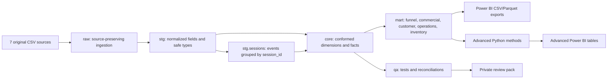

# Architecture

## Layer responsibilities

| Layer | Purpose | Rebuild policy |
|---|---|---|
| `raw` | Load only the seven original files | Replace on rebuild |
| `stg` | Renaming, casting, normalization, privacy boundary, and event-derived sessions | Views |
| `core` | Star-schema dimensions and facts at declared grain | Replace on rebuild |
| `mart` | Decision-oriented aggregates and analytical tables | Replace on rebuild |
| `qa` | Row rules, lineage checks, reconciliations, severity, and status | Replace on rebuild |
| `data/processed` | Power BI and analysis exports | Replace on rebuild |

## Declared grains

- `fact_order`: one row per order.
- `fact_order_item`: one row per order item.
- `fact_session`: one row per distinct `events.session_id`.
- `fact_inventory`: one row per inventory item.
- `customer_360`: one row per purchasing customer.
- `cohort_retention`: one row per cohort-month and months-since-first-order.

No fact-to-fact relationships are used in Power BI.

## Session lineage

`stg.sessions` is a derived view. It aggregates event timing, identity, browser, traffic source, location, and funnel flags from `stg.events`. The source-event count and distinct-session count are reconciled in the QA layer before exports are allowed.
