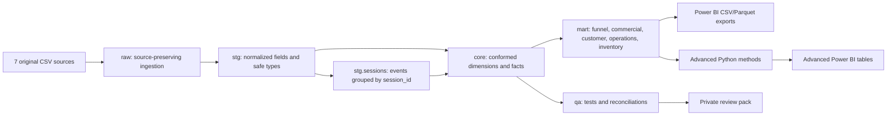

# Technical Reference

## Pipeline architecture

### Layer responsibilities

| Layer | Purpose | Rebuild policy |
|---|---|---|
| `raw` | Load only the seven original files | Replace on rebuild |
| `stg` | Renaming, casting, normalization, privacy boundary, and event-derived sessions | Views (computed live, not stored) |
| `core` | Star-schema dimensions and facts at declared grain | Replace on rebuild |
| `mart` | Decision-oriented aggregates and analytical tables | Replace on rebuild |
| `qa` | Row rules, lineage checks, reconciliations, severity, and status | Replace on rebuild |
| `data/processed` | Power BI and analysis exports | Replace on rebuild |

### Declared grains

- `fact_order`: one row per order.
- `fact_order_item`: one row per order item.
- `fact_session`: one row per distinct `events.session_id`.
- `fact_inventory`: one row per inventory item.
- `customer_360`: one row per purchasing customer.
- `cohort_retention`: one row per cohort-month and months-since-first-order.

No fact-to-fact relationships are used in Power BI.

## Source inventory

The project accepts exactly seven original dataset files.

| Source | Grain | Candidate key | Primary analytical use |
|---|---|---|---|
| `users.csv` | user | `id` | demographics, geography, customer acquisition source |
| `products.csv` | product | `id` | catalog, price, cost, margin, distribution center |
| `orders.csv` | order | `order_id` | status and order-level delivery lifecycle |
| `order_items.csv` | order item | `id` | revenue, profit, product, returns, fulfillment |
| `events.csv` | event | `id` | session reconstruction, behavior sequence, funnel reach |
| `inventory_events.csv` | inventory item | `id` | sell-through, inventory age, time to sell |
| `distribution_centers.csv` | distribution center | `id` | location and operations breakdown |

The source folder may contain artifacts from the original analysis. They are ignored because `src/pipeline.py` loads only the seven declared files. `artifacts/pipeline_run.json` records the accepted filenames, byte sizes, checksums, and raw row counts.

## Session derivation from events

Sessions are a modeled analytical grain, not an original dataset file. The source-of-truth is `events.csv`. The pipeline normalizes the event records and creates one session row for every distinct `session_id`.

**Where the transformation happens:**

- `sql/duckdb/01_staging.sql` → `stg.sessions`
- `sql/duckdb/03_core_facts.sql` → `core.fact_session`
- Audit: `notebooks/03_event_sessionization_audit.ipynb`

### Field derivation

| Session field | Event-based rule | Validation |
|---|---|---|
| `session_id` | Grouping key | Nonblank; unique after grouping |
| `customer_id` | Maximum nonnull `user_id` in the session | At most one distinct nonnull user |
| `event_count` | Count of event rows | Sum across sessions equals source event rows |
| `events_with_user_id` | Count of events with nonnull `user_id` | Used for identity coverage |
| `session_start_at` | Minimum event timestamp | Must not exceed end timestamp |
| `session_end_at` | Maximum event timestamp | Used for session duration |
| `browser` | Browser on the first sequenced event | Stable within a session |
| `traffic_source` | Traffic source on the first sequenced event | Stable within a session |
| `city/state/postal_code` | Location on the first sequenced event | Supporting context only |
| `first_event_type` | Event with minimum sequence number | Auditable funnel entry |
| `final_event_type` | Event with maximum sequence number | Auditable funnel exit |
| Funnel flags | `MAX(1)` when a stage event appears | Home, department, product, cart, purchase, cancel |
| `cart_abandoned_flag` | Cart reached and purchase not reached | Session-level definition |
| `highest_stage` | Highest observed funnel flag | Purchase → Cart → Product → Department → Home |

### Reconciliation evidence

- 2,420,661 event rows → 680,862 distinct session IDs
- Zero blank session IDs
- Zero sessions containing multiple customer IDs
- Zero sessions containing multiple browsers or traffic sources
- Event count sums reconcile exactly

### Identity limitation

- 1,124,527 events have no `user_id`
- 180,862 sessions contain a customer ID; 500,000 remain anonymous
- Anonymous sessions are valid for funnel and traffic analysis but cannot join to customer demographics or RFM segments

### Quality gates

The pipeline blocks the build when:

- An event has no session ID
- The derived session grain is duplicated
- A session contains multiple users, browsers, or traffic sources
- Distinct event session IDs do not reconcile to fact-session rows
- Source event rows do not reconcile to the sum of session event counts

## Testing & validation

The `qa` schema runs primary-key uniqueness, source-to-model row reconciliation, referential integrity, and timestamp checks. `src/validate_project.py` confirms the warehouse exists and all QA tests pass before the build completes. Notebooks 01 and 03 execute top-to-bottom as part of the build.

## Assumptions & limitations

### Data assumptions

- The dataset is synthetic; recommendations demonstrate analytical method.
- Timestamps are treated as UTC after removing the source ` UTC` suffix where required.
- May 2024 is incomplete. Default trend comparisons use complete months.
- Net Sales excludes Cancelled and Returned item value; Gross Sales remains a separate demand KPI.
- Order status is treated as a snapshot classification, not a full event-sourced history.
- Observed Return Rate uses only Complete and Returned items as eligible outcomes.
- Invalid shipment-before-item-created records are excluded from lead-time statistics.
- Session-level identity may be recovered when some events are anonymous and later events identify the session.
- User PII and event IP addresses are excluded from analytics exports.
- Several operational dimensions — delivery lead time by year and by distribution center, sell-through rate by category, cart abandonment by channel/browser — show unusually little variation. Treat this as a generator artifact of the synthetic dataset, not as evidence of genuinely uniform real-world operations.

### Unsupported analyses

- No marketing cost → ROAS/CAC cannot be calculated.
- No promotion/discount field → pricing elasticity cannot be estimated.
- No product lines linked to cart events → product-level cart abandonment unsupported.
- No experiment assignment/exposure data → historical A/B effects cannot be estimated.
- No external delivery benchmark included.

### Session reconstruction caveats

- Sessions are derived from `events.csv` using `session_id`; no original session table exists.
- Customer, browser, and traffic source are expected to be stable within a session and are enforced by blocking tests.
- Anonymous sessions remain in session/funnel analysis but cannot join to customer demographics or RFM segments.
