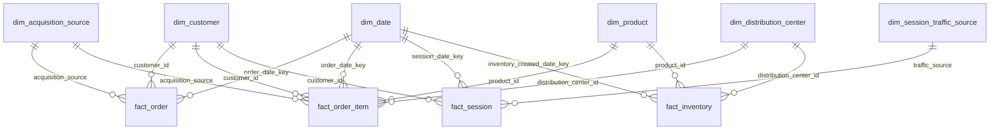

# Power BI semantic model

## Relationship rules

| From | To | Cardinality | Filter |
|---|---|---|---|
| `dim_date[date_key]` | each fact date key | 1:* | Single |
| `dim_customer[user_id]` | customer facts | 1:* | Single |
| `dim_product[product_id]` | item/inventory facts | 1:* | Single |
| `dim_distribution_center[distribution_center_id]` | item/inventory facts | 1:* | Single |
| `dim_session_traffic_source[traffic_source]` | session source | 1:* | Single |
| `dim_acquisition_source[acquisition_source]` | order/item acquisition source | 1:* | Single |

Marts and advanced outputs should normally remain disconnected or connect only to the exact conformed dimension keys they contain. Never create a shortcut relationship that produces multiple active filter paths.

Session traffic source and customer acquisition source are intentionally separate dimensions because their source labels are not a one-to-one taxonomy.

## Session-source lineage

`fact_session` is not imported from an original session file. The backend builds it from `events.csv` grouped by `session_id`, then exports the modeled fact to Power BI. `dim_session_traffic_source` is a small modeled dimension created from the distinct traffic-source values in those derived sessions.
